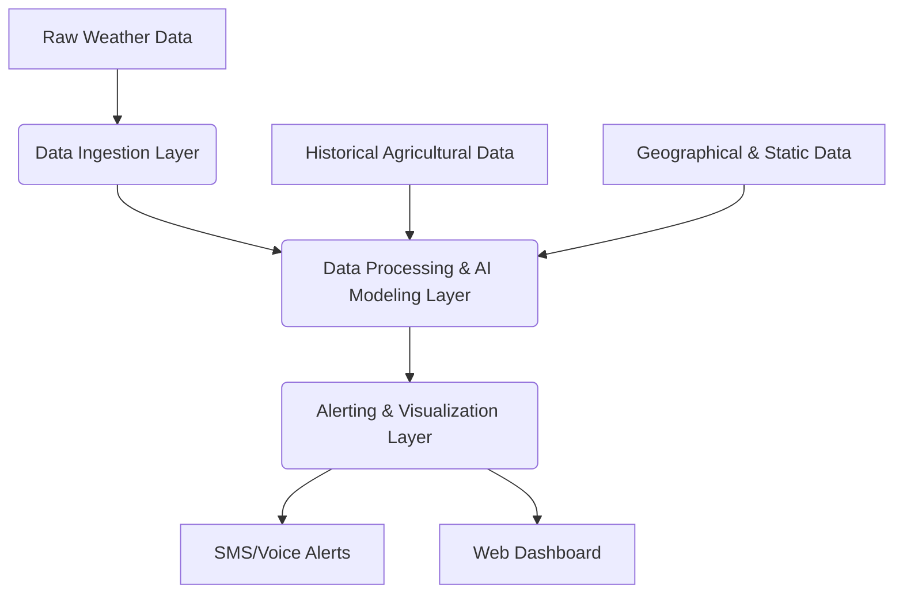

# MonsoonMitra: Architecture Design Document

## 1. Introduction
MonsoonMitra is an AI-driven early warning system designed to provide hyperlocal monsoon failure risk alerts to rain-fed farming villages, initially focusing on India. The primary goal is to empower farmers with actionable insights 10-14 days in advance, enabling proactive measures to mitigate crop losses and improve agricultural resilience against erratic monsoon patterns.

## 2. High-Level Architecture
The system is logically divided into three main layers:
1.  **Data Ingestion Layer**: Collects diverse weather, geographical, and potentially agricultural data.
2.  **Data Processing & AI Modeling Layer**: Processes raw data, runs risk assessment models, and generates insights.
3.  **Alerting & Visualization Layer**: Delivers timely alerts and presents data through an intuitive dashboard.

## 3. Technology Stack (Conceptual/Future)

### 3.1. Data Ingestion Layer
*   **Real-time Precipitation:** Open-Meteo API (current prototype), future: India Meteorological Department (IMD) Radar Data, NASA Global Precipitation Measurement (GPM) via Google Earth Engine.
*   **Soil Moisture:** Satellite data (e.g., NASA SMAP) via Google Earth Engine.
*   **Geographical Data:** National Informatics Centre (NIC) village boundaries (GeoJSON), static soil type maps, elevation data.
*   **IoT Sensors (Future):** MQTT for local weather/water level sensors (e.g., ESP32) -> Google Cloud Pub/Sub.

### 3.2. Data Processing & AI Modeling Layer
*   **Core Logic:** Python scripts (current prototype) for data fetching and basic threshold-based risk assessment.
*   **Data Warehousing (Future):** Google BigQuery for storing historical weather, agricultural, and risk assessment data.
*   **Machine Learning (Future):** Google Vertex AI for:
    *   **Time Series Forecasting:** Predicting short-term precipitation anomalies (e.g., using TempNet or ARIMA models).
    *   **Custom Training:** Building probabilistic models for crop failure risk based on multi-variate inputs (rainfall, soil moisture, historical yield, crop type, phenology).
    *   **Feature Store:** Managing and serving ML features efficiently.
*   **Data Processing:** Python (Pandas, Dask), Apache Beam (Dataflow) for large-scale ETL.

### 3.3. Alerting & Visualization Layer
*   **Local Dashboard (Current Prototype):** Self-contained HTML/CSS/JavaScript generated by Python script.
*   **Web Dashboard (Future):** Looker Studio (connected to BigQuery) for interactive maps, charts, and tables.
*   **SMS/Voice Alerts (Future):** Firebase Cloud Messaging (FCM), Twilio, or AWS SNS for reliable, localized language alerts.
*   **API Gateway (Future):** Google Cloud Endpoints or API Gateway for managing external alert integrations.

## 4. Data Flow

1.  **Scheduled Trigger:** A cron job (local) or Google Cloud Scheduler (future) invokes the MonsoonMitra processing script.
2.  **Data Fetch:** The script pulls data from Open-Meteo (prototype) or Google Earth Engine / IMD APIs.
3.  **Risk Assessment:** Raw weather data is fed into the risk assessment logic (threshold-based for prototype, Vertex AI model for future).
4.  **Result Generation:** Risk levels (HIGH, MEDIUM, LOW) and supporting data are generated for each target village.
5.  **Data Storage (Future):** Results are pushed to BigQuery for historical tracking and dashboarding.
6.  **Alert Generation (Future):** Based on risk levels, SMS/voice messages are formatted in local languages.
7.  **Alert Delivery (Future):** Messages are sent via FCM/Twilio.
8.  **Dashboard Update:** The Looker Studio dashboard automatically refreshes from BigQuery.

## 5. Key Features
*   **Hyperlocal Risk Assessment:** Village-level granularity.
*   **Probabilistic Forecasts:** (Future) Beyond simple thresholds, predicting likelihood of impact.
*   **Multi-language Alerts:** Support for local Indian languages.
*   **Interactive Dashboard:** Visual representation of risk hotspots and trends.
*   **Scalability:** Ability to cover a vast number of villages and regions.

## 6. Scalability and Reliability

### 6.1. Scalability
*   **Serverless Components:** Utilizing Google Cloud's serverless offerings (Cloud Functions, Pub/Sub, BigQuery, Vertex AI) inherently provides horizontal scalability.
*   **Data Partitioning:** BigQuery's architecture handles massive datasets efficiently.
*   **Asynchronous Processing:** Pub/Sub can decouple data ingestion from processing, allowing for high throughput.

### 6.2. Reliability
*   **Redundant Data Sources:** Multiple weather APIs/satellite sources for failover.
*   **Retry Mechanisms:** Implement exponential backoff for API calls.
*   **Monitoring & Alerting:** Google Cloud Operations (Stackdriver) for monitoring system health, logs, and performance.
*   **Disaster Recovery:** Geo-redundant storage for critical data (BigQuery).

## 7. Security Considerations

### 7.1. Data Privacy and Governance
*   **Minimize Data Collection:** Only collect necessary data (e.g., no personal farmer IDs in core risk data).
*   **Anonymization:** Aggregate or anonymize data where possible, especially for public dashboards.
*   **Access Control:** Strict Identity and Access Management (IAM) for Google Cloud resources. Only authorized personnel/services can access sensitive data or modify models.

### 7.2. API Security
*   **API Keys/Authentication:** Use strong, rotating API keys for external services (Open-Meteo) and service accounts for Google Cloud APIs. Store secrets securely (e.g., Google Secret Manager).
*   **Least Privilege:** Grant only the minimum necessary permissions to service accounts and users.
*   **Rate Limiting:** Implement rate limiting on APIs to prevent abuse and manage costs.

### 7.3. System Integrity
*   **Data Validation:** Rigorous input validation at every stage to prevent data corruption or injection attacks.
*   **Immutable Infrastructure:** Deploying services using containerization (e.g., Cloud Run) ensures consistent and secure environments.
*   **Logging and Auditing:** Comprehensive logging of all system actions and access attempts (Cloud Logging, Cloud Audit Logs). Regularly review logs for suspicious activity.

### 7.4. Alerting Security
*   **Phishing Prevention:** Ensure alerts are clearly identifiable as official MonsoonMitra messages to prevent phishing. Avoid including sensitive links in SMS.
*   **Spam Prevention:** Implement safeguards against sending excessive or unwanted alerts.
*   **Secure Delivery:** Use secure communication protocols (HTTPS/TLS) for all data transfers.

### 7.5. Code Security
*   **Secure Coding Practices:** Follow best practices (e.g., OWASP Top 10 for web components, secure Python coding).
*   **Code Review:** Mandatory code reviews to identify security vulnerabilities.
*   **Dependency Scanning:** Regularly scan third-party libraries (`requests`, etc.) for known vulnerabilities.

## 8. Roadmap (Conceptual)
1.  **Phase 1: Prototype & Local Dashboard (Current)**
    *   Basic script with Open-Meteo API.
    *   Threshold-based risk assessment.
    *   Local HTML dashboard.
2.  **Phase 2: Cloud Integration & Basic Web Dashboard**
    *   Integrate with Google Cloud BigQuery for data storage.
    *   Develop a Looker Studio dashboard.
    *   Explore IMD/Earth Engine data ingestion.
3.  **Phase 3: Advanced AI & Alerting**
    *   Develop and deploy Vertex AI ML models for probabilistic risk assessment.
    *   Integrate with SMS/voice gateway for multi-language alerts.
    *   Add more data sources (e.g., soil moisture, historical yield).
4.  **Phase 4: Expansion & Community Engagement**
    *   Expand coverage to more regions/crops.
    *   Integrate citizen reporting (e.g., WhatsApp bot).
    *   Partner with local agricultural agencies and NGOs.
